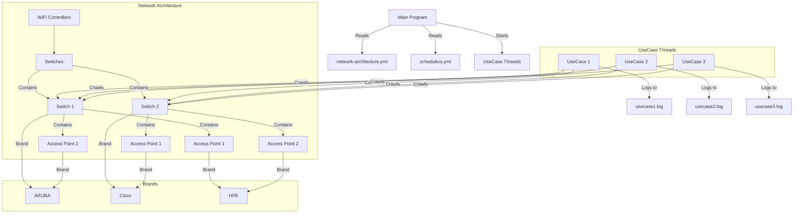

# <center>WiFi Crawler</center>

<!-- TOC -->

* [WiFi Crawler](#centerwifi-crawlercenter)
* [1. Getting Started](#1-getting-started)

<!-- TOC -->

# 1. Getting Started
## 1.1 Setup Python Anaconda

1. Install [Anaconda](https://www.anaconda.com/download) to handle the project Python dependencies

2. Create the `wifi-crawler` Conda environment to install the dependencies inside the [conda.env.yml](./conda.env.yml)
   of this project:
    ```bash
   conda env create --file conda.env.yml
   ```
   **Note** : Run this command from your `project root path`

3. Check the `wifi-crawler` environment existence:
    ```bash
   conda env list
    ```
   **Output**:

   ```console
   # conda environments:
   #
   base                     /home/$USER/miniconda3
   wifi-crawler          *  /home/$USER/miniconda3/envs/wifi-crawler
   ```

4. Activate the `wifi-crawler` environment
   ```bash
   conda activate wifi-crawler
   ```
   
   **Output**:

   ```console
   (wifi-crawler) ....
   ```

   **Note**: Your terminal will contain the name of your active `conda env` in the front.
   
## 1.2 Setup credentials
1. Copy & rename [example.credentials.yml](Connections/example.credentials.yml) to be `credentials.yml`
2. Update the ssh connection credentials inside your [credentials.yml](credentials.yml) file.

# 2. Run the Crawler
1. Go to project `root path`
2. Run the [main.py](./main.py) file:
   ```bash
   python3 main.py
   ```
   
   **Output**:
   
   In this current version, the script will run the PoE switch crawler & print it in the terminal.
   
   ```console
   <HPE-POE-test>display poe interface power
    Interface    Current   Peak      Max       PD Description                      
                 (W)       (W)       (W)                                           
    GE1/0/1      5.9       7.1       30.0                                          
    GE1/0/2      0.0       0.0       30.0                                          
    GE1/0/3      0.0       0.0       30.0                                          
    GE1/0/4      0.0       0.0       30.0                                          
    GE1/0/5      0.0       0.0       30.0                                          
    GE1/0/6      0.0       0.0       30.0                                          
    GE1/0/7      0.0       0.0       30.0                                          
    GE1/0/8      0.0       0.0       30.0                                          
    GE1/0/9      0.0       0.0       30.0                                          
    GE1/0/10     0.0       0.0       30.0                                          
    GE1/0/11     0.0       0.0       30.0                                          
    GE1/0/12     0.0       0.0       30.0                                          
    GE1/0/13     0.0       0.0       30.0                                          
    GE1/0/14     0.0       0.0       30.0                                          
    GE1/0/15     0.0       0.0       30.0                                          
    GE1/0/16     0.0       0.0       30.0                                          
    GE1/0/17     0.0       0.0       30.0                                          
    GE1/0/18     0.0       0.0       30.0                                          
    GE1/0/19     0.0       0.0       30.0                                          
    GE1/0/20     0.0       0.0       30.0                                          
    GE1/0/21     0.0       0.0       30.0                                          
    GE1/0/22     0.0       0.0       30.0                                          
    GE1/0/23     0.0       0.0       30.0                                          
    GE1/0/24     0.0       0.0       30.0                                          
      ---  On State Ports: 1; Used: 5.9(W); Remaining: 364.1(W)  ---
   
   
   
   Process finished with exit code 0
   ```

# 2. System Architecture

